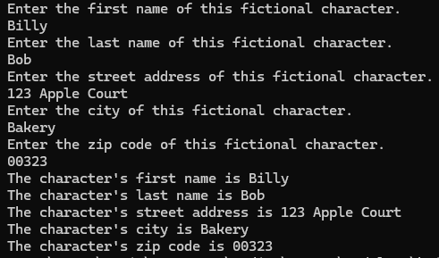
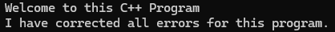
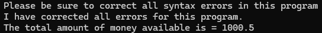

# Module 1
This project contains three separate simple programs: one for creating a fictional character via user input, and the other two for simply displaying information.

## Usage
1. Ensure you are in the correct directory of the sub-project.
2. Run ```cmake -S . -B build``` to generate build files.
3. Run ```cd build``` to enter build directory.
4. Depending on the generator use corresponding command to build the binaries of the project.
    - For Visual Studio Generators run ```MSBuild Module_1.sln``` 
    - For Makefile Generators run ```make```
5. Enjoy the program(s)!

## Examples
Image of fictional character program running. <br>
 <p>
Image of "CSC450_CT1_mod1-1" program running. <br>
 <p>
Image of "CSC450_CT1_mod1-2" program running. <br>
 <p>

## Note
The input types in the fictional character program are strings and will result in an error if left empty.