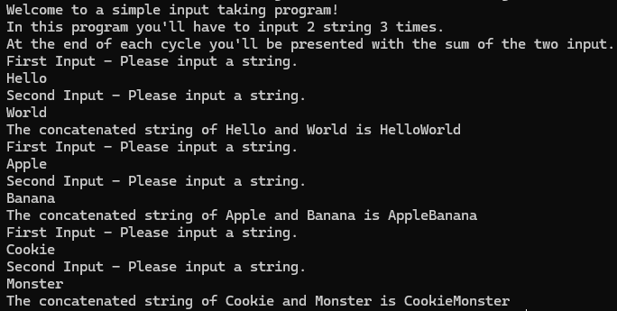

# Module 2
A simple C++ console application that works with strings. In this program, it prompts the user to enter a string of their choice twice, which then gets concatenated and displayed back to them. This process happens a total of 3 times before the program exits.

## Usage
1. Ensure you are in the correct directory of the sub-project.
2. Run ```cmake -S . -B build``` to generate build files.
3. Run ```cd build``` to enter build directory.
4. Depending on the generator use corresponding command to build the binaries of the project.
    - For Visual Studio Generator(s) run ```MSBuild Module_2.sln```
    - For Makefile Generator(s) run ```make```
5. Enjoy the program(s).

## Examples


## Notes
The program may not exit properly if it is force quit. It requires user input to work properly.
