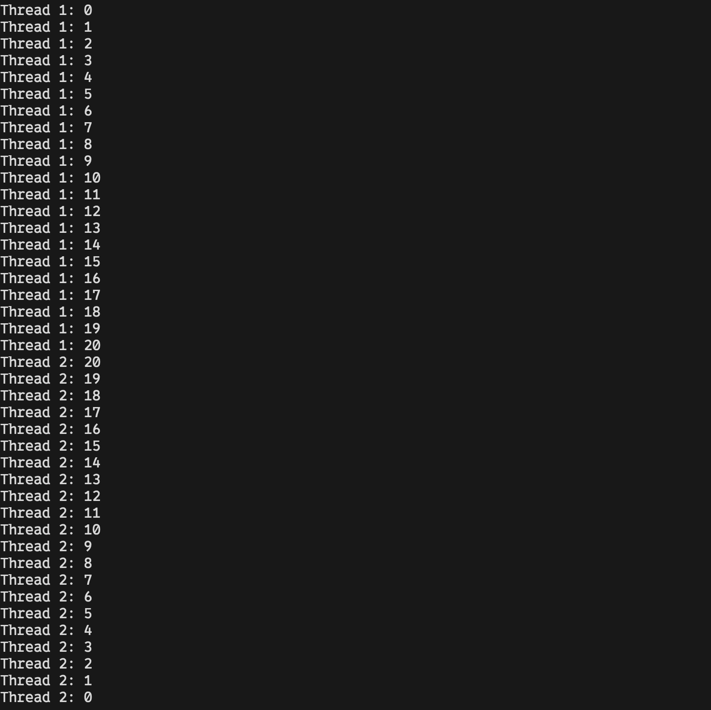

# Module 7
A simple C++ program that uses concurrency of threads to count up to 20 and down to 0. 

## Usage
1. Ensure you are in the correct directory of the sub-project.
2. Run ```cmake -S . -B build``` to generate build files.
3. Run ```cd build``` to enter build directory.
4. Depending on the generator use corresponding command to build the binaries of the project.
    - For Visual Studio Generator(s) run ```MSBuild Module_7.sln```
    - For Makefile Generator(s) run ```make```
5. Enjoy the program(s).

## Examples


## Notes
The program may not exit properly if it is force quit.
